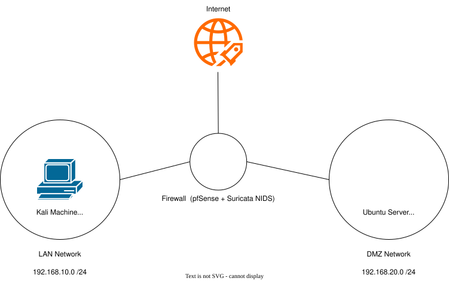
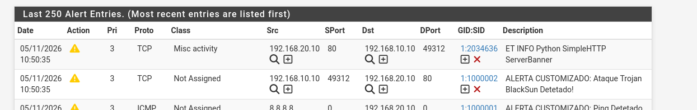

# Cybersecurity Home Lab: Network Segregation & NIDS Implementation

## 📝 Executive Summary
This project demonstrates the design, deployment, and configuration of a virtualized Security Operations Center (SOC) lab environment. It focuses on implementing strict network segregation, stateful firewall rules, and real-time network traffic analysis using Deep Packet Inspection (DPI). The goal of this lab is to simulate real-world cyber attacks from a Red Team perspective and successfully detect/mitigate them using Blue Team defensive strategies.

## 🏗️ Network Architecture
The infrastructure is built on Oracle VirtualBox and divided into three isolated zones to enforce the Principle of Least Privilege:
* **WAN (Internet):** Simulated external network.
* **LAN (Management/Attacker Zone):** Hosts the Kali Linux machine used for administration and offensive simulations.
* **DMZ (Demilitarized Zone):** Hosts the Ubuntu Server (Target). Strict firewall rules prevent the DMZ from initiating traffic to the LAN.

## 🛠️ Technologies & Tools
* **Firewall / Router:** pfSense
* **NIDS/IPS:** Suricata (with Emerging Threats Open Rules)
* **Offensive Security:** Kali Linux (Nmap, cURL, Custom Payloads)
* **Target Server:** Ubuntu Server 24.04 LTS
* **Hypervisor:** Oracle VirtualBox

## 💡 Key Learnings & Achievements
1. **Firewall Configuration:** Configured pfSense interfaces, DHCP servers, and strict stateful firewall rules to isolate the DMZ from the LAN.
2. **IDS Implementation:** Deployed Suricata NIDS, resolved hardware checksum offloading issues in virtualized environments, and enabled Promiscuous Mode for full packet capture.
3. **Deep Packet Inspection (DPI):** Successfully detected anomalous ICMP traffic and specific malware signatures (e.g., BlackSun Trojan).
4. **Red Team Evasion:** Simulated Nmap Stealth SYN scans to understand how certain attack vectors can bypass basic IDS thresholds.

## 🎯 Proof of Concept (PoC)

### Detecting Malware Signatures (BlackSun Trojan)
A simulated HTTP request containing a known malware signature was launched from the Kali Linux (LAN) to the Ubuntu Server (DMZ) using a temporary Python HTTP server.

**Attack Command:**
`curl -A "BlackSun" http://192.168.20.10`

**Suricata Detection Log:**

---
*Check the `docs/` folder for detailed step-by-step configurations and attack simulations.*
